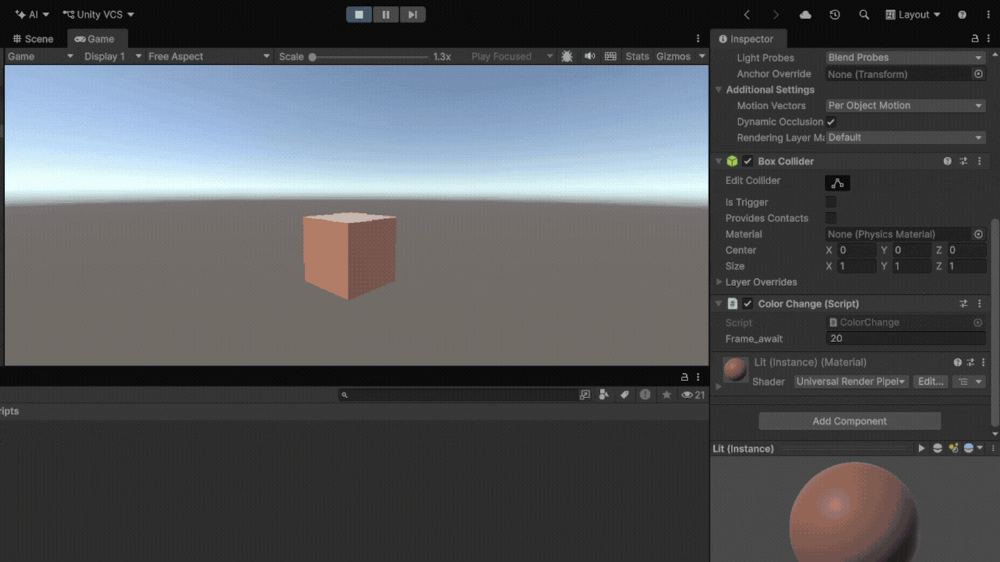
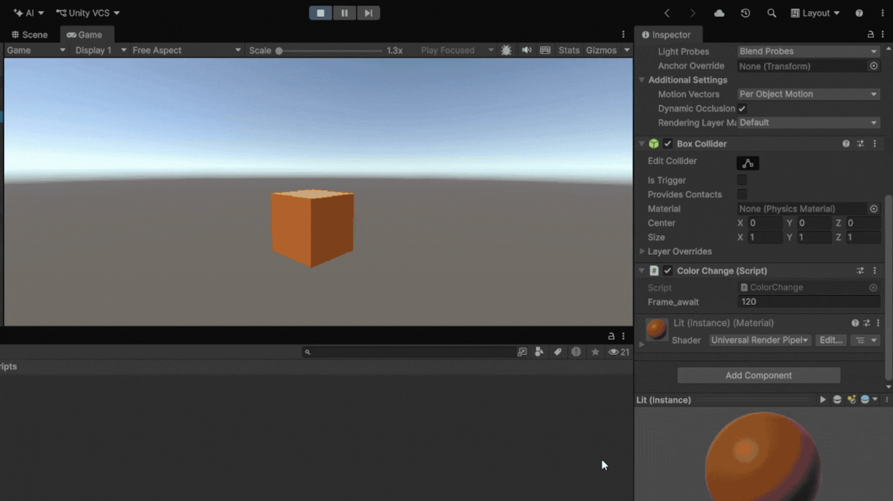
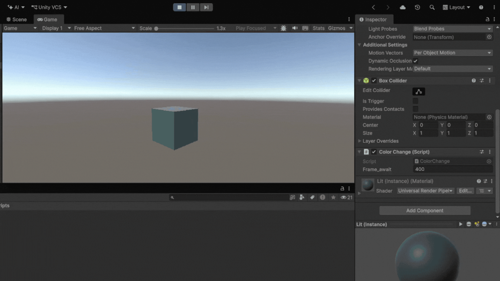
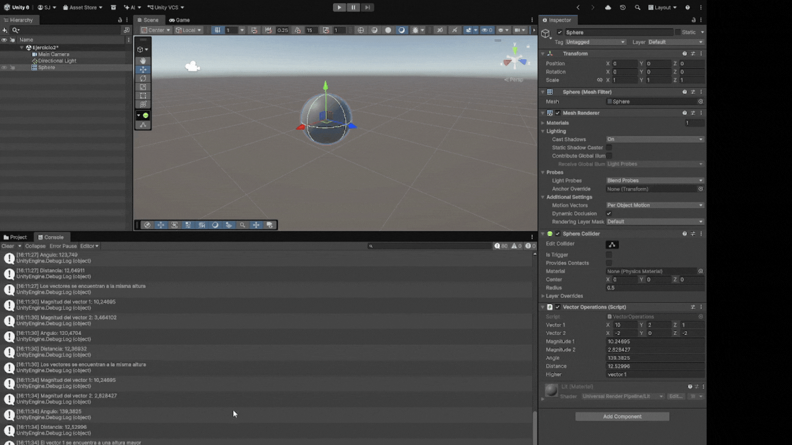
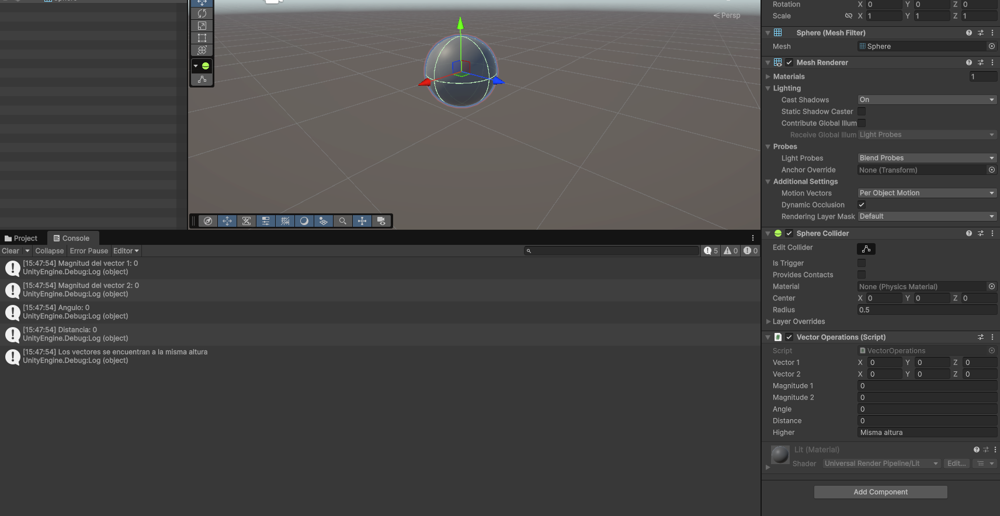
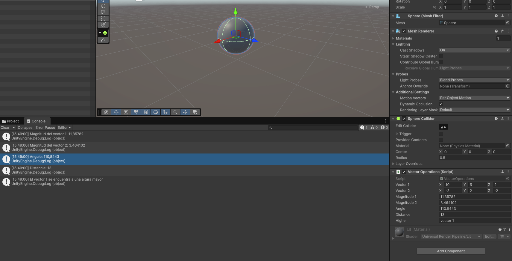
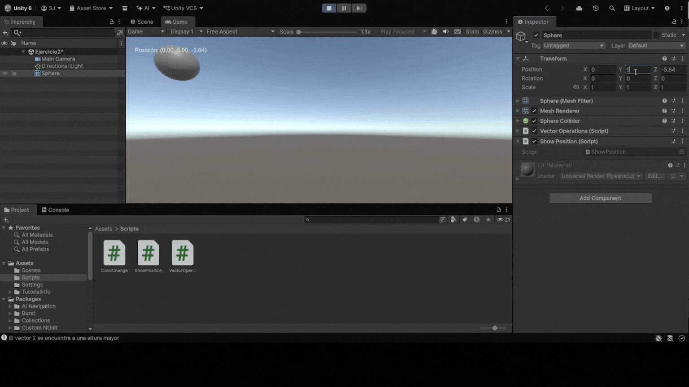

# Practica1 - II 
Práctica 1 de Interfaces Inteligentes

* **Autor:** Sonia Frías Jiménez 
* **ALU** alu0101492513@ull.edu.es
* **Versión de Unity:** 6.6

  
<b>Índice de ejercicios</b>

  1. [Ejercicio 1](#Ejercicio-1)
  2. [Ejercicio 2](#Ejercicio-2)
  3. [Ejercicio 3](#Ejercicio-3)
  4. [Ejercicio 4](#Ejercicio-4)

## Ejercicio 1
Este ejercicio pide crear un script que asigne un color a un objeto y que, posteriormente, en cada intervalo de frames altere una componente RGB al azar. El intervalo de frames debe ser inicializado a 120 y debe ser posible cambiarlo a través del inspector.

### Hitos 
* Asociar a un objeto de la escena un script
* Controlar los intervalos de tiempo mediante frames
* Uso de clases simples como Color, Vector3 y Random 

### Implementación
* **Color:** Para controlar el color del objeto se usa un `Vector3` inicializado con valores aleatorios con Random.value en el rango (0.0f, 1.0f), mapeados a `Color(x, y, z)` sobre el material del Renderer que hemos obtenido a través de la llamada a la función `GetComponent<Renderer>()`.
* **Temporización:** En `Update()`, se mide el avance de frames mediante `Time.frameCount`. Al alcanzar `frameAwait`, se dispara el cambio.
* **Cambio de color:** Con `Random.Range(0, 3)` se elige un índice de Vector3 al azar y se actualiza solo esa componente usando el indizador `color[index]` y aplicando el nuevo color al objeto.

### Pruebas
Prueba para 20 frames

Prueba para 120 frames

Prueba para 300 frames

## Ejercicio 2
El ejercicio consiste en realizar una serie de operaciones básicas sobre vectores: magnitud, ángulo entre dos vectors, distancia y obtener cual se encuentra a mayor altura.

### Hitos
 * Aprender y aplicar los métodos de Vector3
 * Mostrar datos en el inspector sin permitir su modificación
 * Ejecutar código cuando se detecta un cambio en las variables

### Implementación
Para representar los vectores he utilizado instancias de `Vector3` tal y como pide el enunciado.

Las medidas se calculan dentro del método `OnValidate()` que se ejecuta cada vez que se detecta un cambio en las variables públicas de clase (vector 1 o vector2)
Para calcular las medidas se hacen llamadas a los métodos de la propia clase Vector3.

### Pruebas
GIF de prueba

Prueba con vectores iguales

Prueba con el Vector 1 más alto

Prueba con el Vector 2 más alto

## Ejercicio 3
Consiste en mostrar en la pantalla un texto con la posición de un componente, en este caso una esfera.
Para ello se utiliza la función `OnGUI()` que muestra elementos en la pantalla, para mostrar un texto usamos `Label`.

Prueba del ejercicio

## Ejercicio 4
