# Practica1 - II 
Práctica 1 de Interfaces Inteligentes

* **Autor:** Sonia Frías Jiménez 
* **ALU** alu0101492513@ull.edu.es
* **Versión de Unity:** 6.6

  
<b>Índice de ejercicios</b>

  1. [Ejercicio 1](#Ejercicio-1)
  2. [Ejercicio 2](#Ejercicio-2)
  3. [Ejercicio 3](#Ejercicio-3)
  4. [Ejercicio 4](#Ejercicio-4)
  5. [Ejercicio 5](#Ejercicio-5)
  6. [Ejercicio 6](#Ejercicio-6)
  7. [Ejercicio 7](#Ejercicio-7)
  8. [Ejercicio 8](#Ejercicio-8)
  9. [Ejercicio 9](#Ejercicio-9)
  10. [Ejercicio 10](#Ejercicio-10)
  11. [Ejercicio 11](#Ejercicio-11)
  12. [Ejercicio 12](#Ejercicio-12)
  13. [Ejercicio 13](#Ejercicio-13)

## Ejercicio 1
Este ejercicio pide crear un script que asigne un color a un objeto y que, posteriormente, en cada intervalo de frames altere una componente RGB al azar. El intervalo de frames debe ser inicializado a 120 y debe ser posible cambiarlo a través del inspector.

### Hitos 
* Asociar a un objeto de la escena un script
* Controlar los intervalos de tiempo mediante frames
* Uso de clases simples como Color, Vector3 y Random 

### Implementación
* **Color:** Para controlar el color del objeto se usa un `Vector3` inicializado con valores aleatorios con Random.value en el rango (0.0f, 1.0f), mapeados a `Color(x, y, z)` sobre el material del Renderer que hemos obtenido a través de la llamada a la función `GetComponent<Renderer>()`.
* **Temporización:** En `Update()`, se mide el avance de frames mediante `Time.frameCount`. Al alcanzar `frameAwait`, se dispara el cambio.
* **Cambio de color:** Con `Random.Range(0, 3)` se elige un índice de Vector3 al azar y se actualiza solo esa componente usando el indizador `color[index]` y aplicando el nuevo color al objeto.

### Pruebas
Prueba para 20 frames
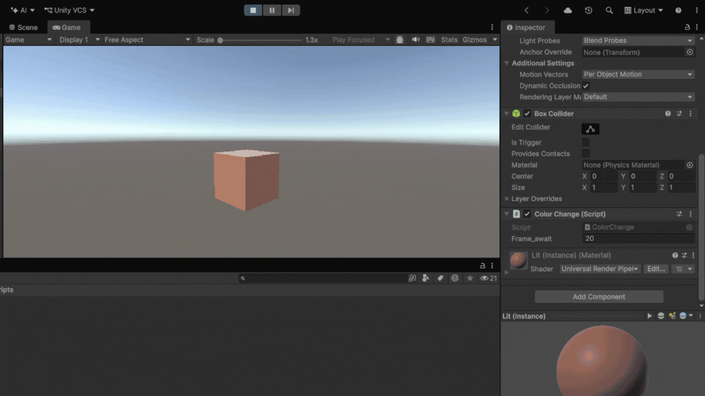
Prueba para 120 frames
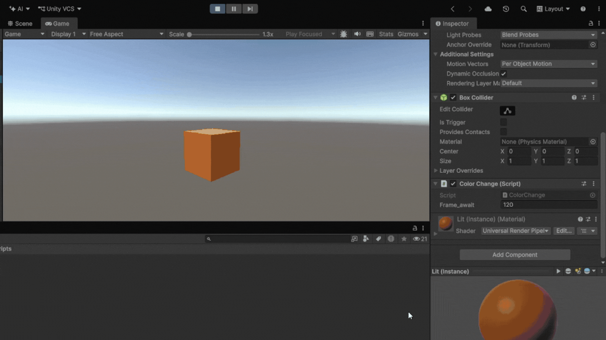
Prueba para 300 frames
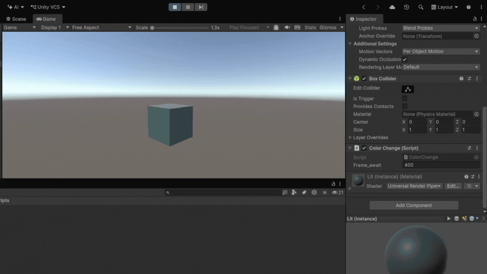

## Ejercicio 2
El ejercicio consiste en realizar una serie de operaciones básicas sobre vectores: magnitud, ángulo entre dos vectors, distancia y obtener cual se encuentra a mayor altura.

### Hitos
 * Aprender y aplicar los métodos de Vector3
 * Mostrar datos en el inspector sin permitir su modificación
 * Ejecutar código cuando se detecta un cambio en las variables

### Implementación
Para representar los vectores he utilizado instancias de `Vector3` tal y como pide el enunciado.

Las medidas se calculan dentro del método `OnValidate()` que se ejecuta cada vez que se detecta un cambio en las variables públicas en el inspector.
Para calcular las medidas se hacen llamadas a los métodos de la propia clase Vector3.

### Pruebas
GIF de prueba
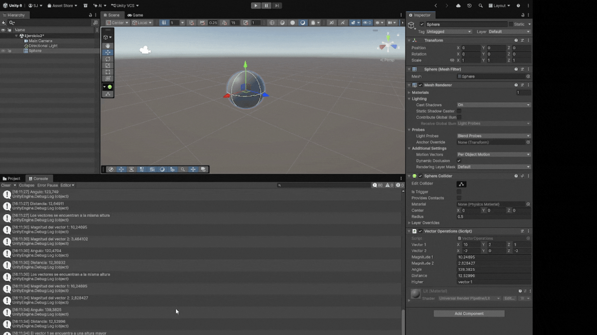
Prueba con vectores iguales
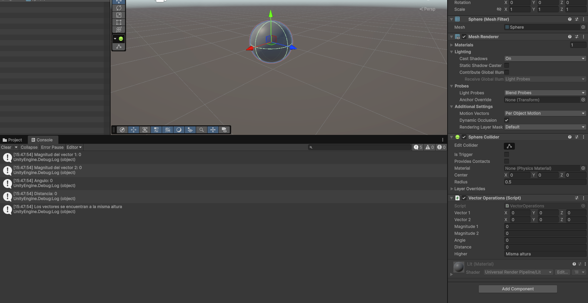
Prueba con el Vector 1 más alto
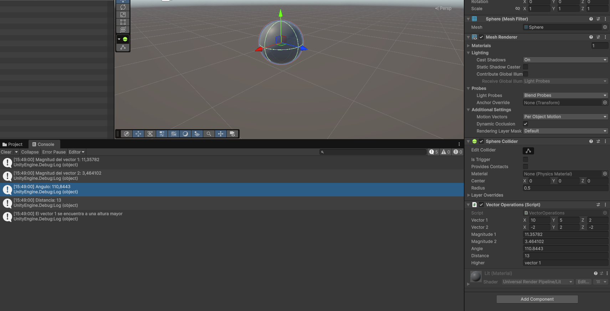
Prueba con el Vector 2 más alto

## Ejercicio 3
Consiste en mostrar en la pantalla un texto con la posición de un componente, en este caso una esfera.
Para ello se utiliza la función `OnGUI()` que muestra elementos en la pantalla, para mostrar un texto usamos `Label`.

### Prueba
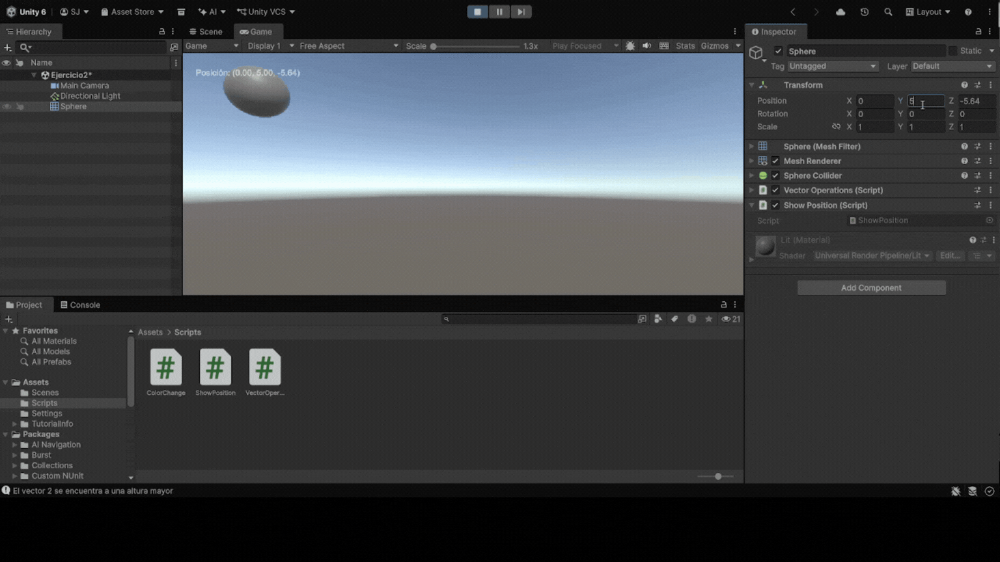

## Ejercicio 4
Para el último ejercicio de la práctica se pide asociar un script a la esfera que muestre por consola la distancia a un cubo y una esfera que se encuentran en la escena.

### Hitos 
 * Obtener referencias a otros objetos de la escena
 * Asignar etiquetas a los objetos

### Implementación
Al igual que en el ejercicio 2 se usan los métodos de la clase `Vector3` para calcular la distancia entre vectores, que en este caso representan la posición de los elementos en la escena. 
Para obtener las referencias a los objetos que se piden se utiliza el método `GameObject.FindWithTag("Sphere")`.
En este caso, dado que no se especifica en el enunciado que se deba actualizar la posición de los elementos en la escena se ha implementado todo en el `Start()`

### Prueba
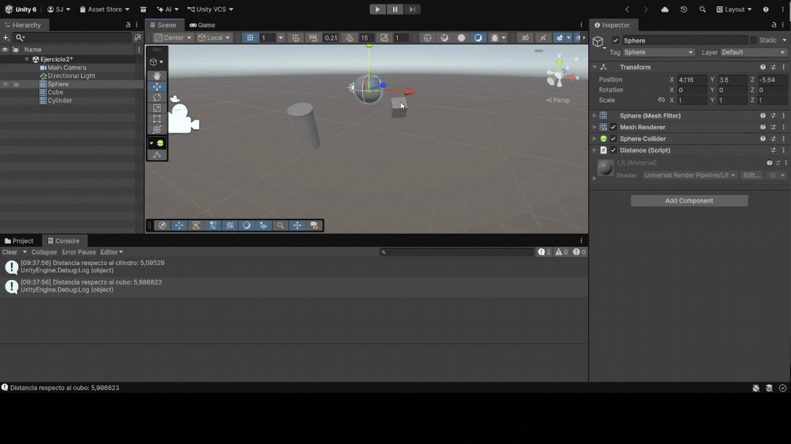

## Ejercicio 5
El ejercicio pide implementar un script que cuente con una variable publica delta que represente un desplazamiento en los 3 ejes (x,y,z) y se asigne a 3 objetos distintos. Cuando se pulse el espacio debe desplazarse teniendo en cuenta el desplazamiento establecido.

### Implementación
Para saber si una tecla ha sido pulsada se usa `Input.GetAxis()`, sin embargo este método devuelve un valor de en el rango [0,1] para los ejes unidirecionales (como es el caso de `Jump`, el eje que buscamos). El valor devuelto por este método incrementa en el tiempo mientras se esté pulsando, esto implica que si simplemente se comprueba `Input.GetAxis('Jump')` el desplazamiento se aplique múltiples veces y no solo en el momento de pulsar la tecla.

### Prueba
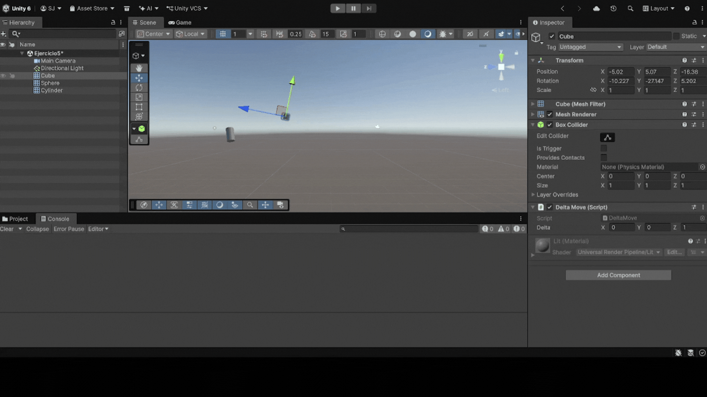

## Ejercicio 6
Este ejercicio consiste en detectar cada vez que se pulsa una tecla en concreto y calcular el valor del axis multiplicado por una constante de velocidad. Dado que `Input.GetKey()` retorna verdadero mientras se está pulsando la tecla y no solo en el punto de pulsar o levantar se obtienen múltiples valores, obteniendo la progresión de la velocidad en lugar de un único valor.

### Prueba
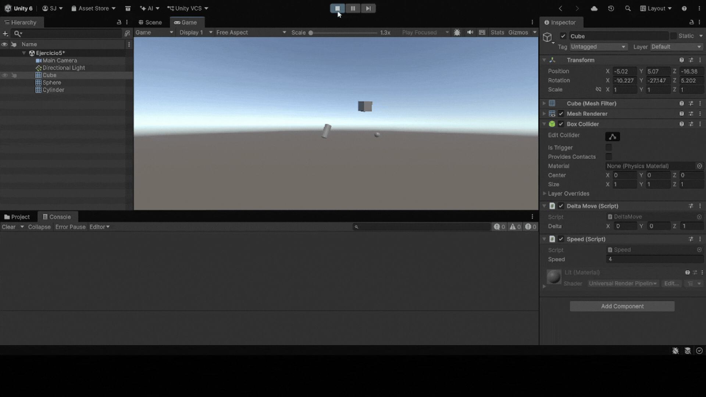

## Ejercicio 7
Cambiar la tecla de disparo a `h`.

### Prueba
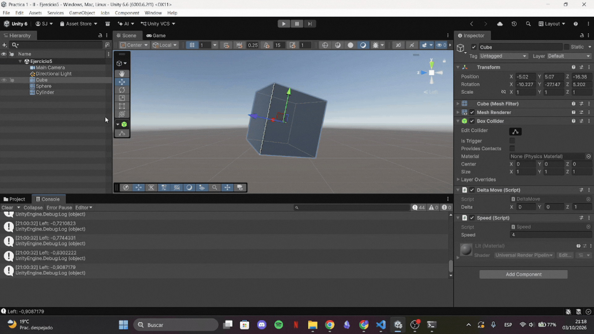

## Ejercicio 8
El ejercicio pide asociar al cubo con un script que dado una dirección (Vector3) y la velocidad se mueva el objeto. Además, pide analizar que sucede en las siguientes situaciones:

### 1. Duplicar las coordenadas de la dirección del movimiento
La velocidad efectiva de traslación se duplica. Dado que el vector director no se normaliza previamente, su magnitud actúa directamente como factor multiplicativo.

### 2. Duplicar la velocidad manteniendo la dirección del movimiento
La velocidad resultante también se duplica. 

### 3. La velocidad usada es menor que 1
* **Si 0 < velocida < 1:** El cubo continúa desplazándose en la dirección indicada, pero a menor velocidad
* **Si velocidad < 0:** El signo negativo invierte el sentido de la dirección

### 4. La posición del cubo tiene y > 0
La altura no afecta a la traslación del cubo.

### 5. Intercambiar movimiento relativo al sistema de referencia local y mundial
* **Sistema Local:** El vector de traslación se proyecta sobre los ejes propios del objeto. Por tanto, si el cubo está rotado, un desplazamiento en `(1, 0, 0)` moverá el objeto hacia su propia "derecha local", lo que en la cuadrícula de la escena se verá como una trayectoria diagonal.
* **Sistema Mundial:** El desplazamiento se proyecta sobre los ejes absolutos del escenario. No importa la rotación del cubo, este se moverá siguiendo los ejes fijos del mundo.

### Prueba

Con el sistema de referencia local

Con el sistema de referencia mundial
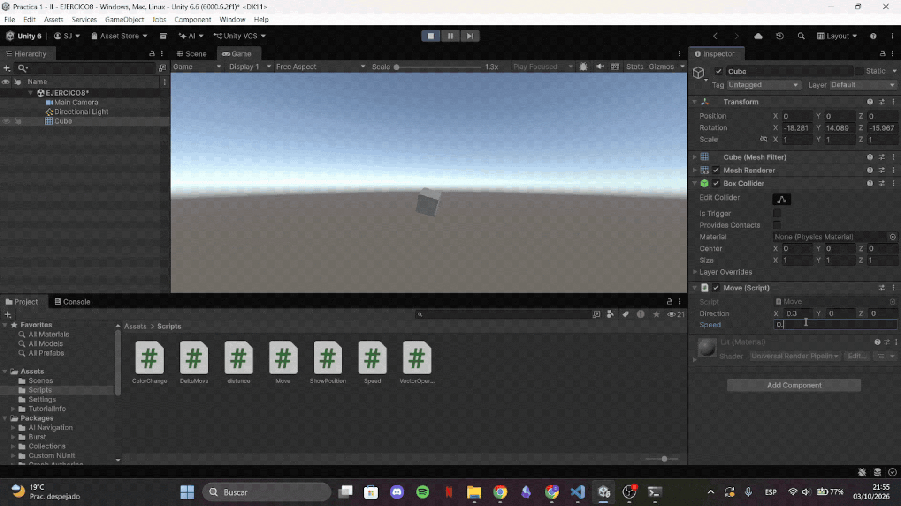

## Ejercicio 9
Para este ejercicio se pide mover dos objetos de la escena utilizando distintos controles para cada uno de ellos. Dado que el código a ejecutar es el mismo pero con la diferencia de los controles he utilizado el mismo script al que se le asignan los controles correspondientes en el inspector mediante 4 variables de tipo KeyCode.

### Prueba
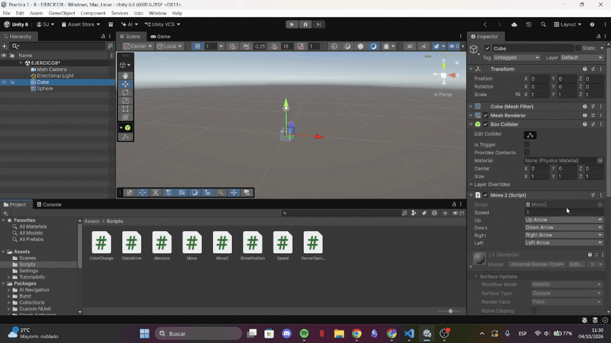

## Ejercicio 10
Para adaptar el movimiento para que sea proporcional al tiempo transcurrido durante la generación del frame simplemente multiplicamos por `Time.deltatime`.

### Prueba 
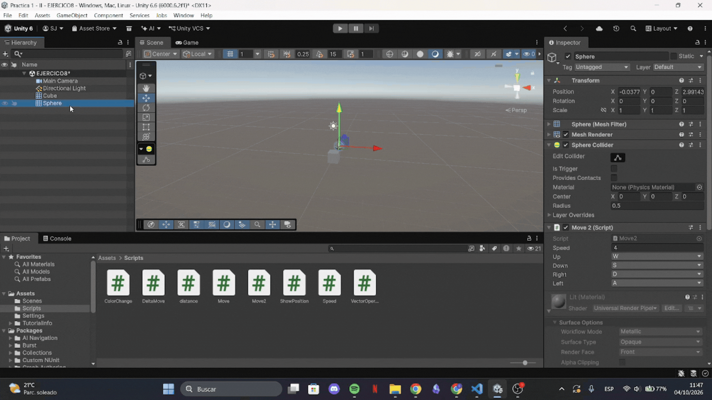
 
## Ejercicio 11
El ejercicio pide modificar el script anterior para el cubo. Dado que el cubo y la esfera compartían el mismo script he dejado el script intacto y he creado uno nuevo para el cubo. 

Para este script guardo una referencia a la esfera mediante `FindWithTag`que usaré en el update para calcular el vector dirección que debe utilizar el cubo para desplazarse hacia la esfera. Para que no influya la distancia en la velocidad he normalizado el vector resultante de restar la posición de la esfera y la del cubo con `normalize()` y para que el desplazamiendo sea proporcional al tiempo trascurrido he usado `Time.deltatime` junto a la velocidad establecida en el inspector. Además, se ha de tener en cuenta que la componente `y` del cubo no debe cambiar, esto podría suceder si la esfera no se encuentra a la misma altura, por ello añado `direction.y = 0` para asegurarlo.

### Prueba
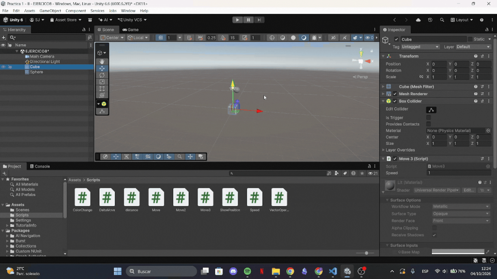